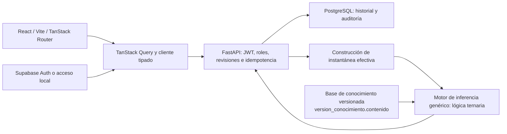

# Arquitectura e integración

Este documento describe la arquitectura web. La arquitectura del **sistema experto**
(base de conocimiento, base de hechos, motor, explicación y adquisición) está en
[`ARQUITECTURA_SE.md`](ARQUITECTURA_SE.md).

La aplicación usa React/Vite con rutas, datos reales, estados de carga/error y captura guiada. Funciona como SPA autenticada, servida por Vite en desarrollo o Nginx en contenedor.

El navegador nunca calcula una autorización ni decide permisos. Los roles se leen de PostgreSQL tras validar JWT, emisor, audiencia y algoritmo. La conexión SQL pertenece al backend; el esquema privado no depende de la Data API de Supabase.

Las mutaciones se serializan mediante un bloqueo transaccional asesor de PostgreSQL compartido por los trabajadores. Es una decisión conservadora para este piloto: evita carreras entre revisiones, instantáneas, vigencia e incidencias. Limita el rendimiento de escritura; para escalar se deberá sustituir por bloqueos por unidad/almacén con orden consistente y pruebas de concurrencia.

Observaciones y evaluaciones son inmutables. La evaluación almacena instantánea efectiva, procedencia aplicada, reglas, cálculos y versión. Reutilizar observaciones no altera su registro original. Un dato posterior desconocido o inválido no revive una medición favorable anterior.

Los eventos, controles, planes, cambios de metadatos y actuaciones técnicas modifican revisiones e invalidan autorizaciones previas. Un control adverso abre la incidencia aunque no se solicite evaluación. Una lectura GET no modifica el historial. Resolver una incidencia exige técnico asignado y no emite una autorización: hace falta reevaluar.

Las fechas viajan con zona horaria y se guardan en UTC. La captura usa hora local del navegador y la presentación del historial usa America/Lima. Los valores desconocidos y NO_APLICA tienen semántica propia; el servidor comprueba la aplicabilidad contextual.

Detalles del [motor](MOTOR.md), [base de datos](BASE_DATOS.md), [seguridad](SEGURIDAD.md) y [trazabilidad](TRAZABILIDAD.md).
