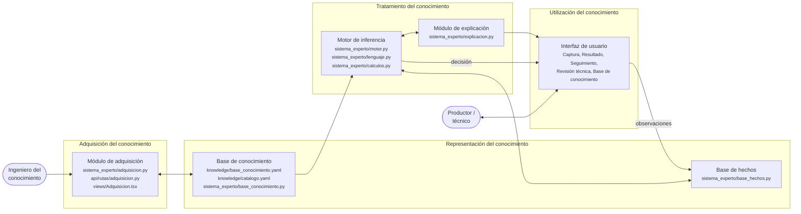
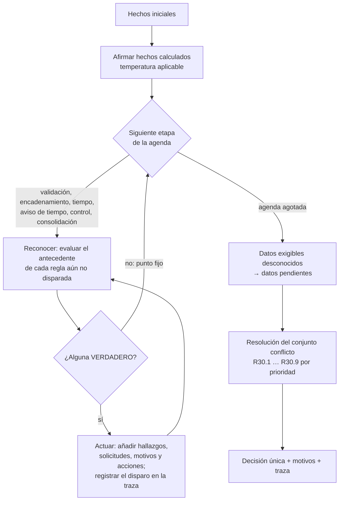

# Arquitectura del sistema experto

POSCOSEGRAN sigue la arquitectura clásica de un sistema experto basado en reglas.
Este documento enlaza cada componente del modelo con el código que lo implementa y
explica cómo razona el sistema. La arquitectura web (API, base de datos, frontend)
se describe aparte en `ARQUITECTURA.md`: es la infraestructura sobre la que corre
el sistema experto, no el sistema experto en sí.

## Componentes



| Componente | Qué contiene | Dónde |
|---|---|---|
| **Base de conocimiento** | 29 parámetros con fundamento y fuente, 26 definiciones (hechos favorables de la sección 3.2), 40 reglas de producción SI–ENTONCES, tabla de tiempo NDSU, 24 datos exigibles, 9 ramas de resolución R30 y restricciones de integridad. El texto documental de cada regla vive en `catalogo.yaml`. | `knowledge/base_conocimiento.yaml`, `knowledge/catalogo.yaml`; cargador y validador en `sistema_experto/base_conocimiento.py`; en producción, `version_conocimiento.contenido` |
| **Base de hechos** | Hechos *iniciales* (observaciones, contexto de la unidad, controles, episodios abiertos, plan, dictamen) y hechos *inferidos* durante la evaluación (hallazgos y solicitudes), con la traza de cada disparo. | `sistema_experto/base_hechos.py`; se guarda con cada evaluación en `entrada_efectiva._hechos_iniciales` |
| **Motor de inferencia** | Ciclo reconocer–actuar genérico. No contiene umbrales, reglas ni prioridades del dominio: interpreta la base que recibe. | `sistema_experto/motor.py`, `lenguaje.py`, `calculos.py` |
| **Módulo de explicación** | ¿Cómo se llegó a la decisión? ¿Por qué no se autorizó? ¿Por qué se pide este dato? | `sistema_experto/explicacion.py`; `GET /evaluaciones/{id}/explicacion`; panel en `views/Resultado.tsx`; ayuda en `components/Captura.tsx` |
| **Módulo de adquisición** | Proponer cambios de parámetros o de reglas, validarlos, medir su impacto y activarlos como nueva versión. | `sistema_experto/adquisicion.py`; rutas `/adquisicion/*`; `views/Adquisicion.tsx`; rol `INGENIERO_CONOCIMIENTO` |
| **Interfaz de usuario** | Captura guiada en seis pasos, resultado explicado, seguimiento, revisión técnica, almacenes y lotes, consulta de la base. | `src/views/*`, `src/components/*` |

### La prueba de la separación

La separación entre conocimiento y motor no es solo una declaración de diseño;
hay pruebas que la comprueban (`backend/tests/test_base_conocimiento.py`):

- `test_el_motor_no_contiene_umbrales_del_dominio` recorre el árbol sintáctico del
  motor, el lenguaje y los cálculos, y falla si encuentra como literal cualquier
  valor de parámetro de la base.
- `test_cambiar_un_parametro_cambia_la_decision` evalúa el mismo caso con el mismo
  motor y dos bases distintas: con la humedad de admisión en 14 % el ingreso se
  bloquea; con 15 %, no.
- `test_casos_de_referencia_se_reproducen` evalúa 242 casos congelados y exige las
  mismas decisiones, ramas, reglas y datos pendientes.

## Representación del conocimiento

### Reglas de producción

Cada regla es un dato con antecedente (`si`), consecuente (`entonces`), evidencias
y, si procede, una condición de aplicabilidad:

```yaml
- id: R01
  si:
    todos:
      - {definicion: medicion_confirmada}
      - {dato: humedad_grano, op: GT, valor: {param: humedad_admision_max}}
  entonces:
    hallazgo: HUMEDAD_NO_APTA
    solicitudes: [SUSPENSION]
    mensaje: "Humedad confirmada {dato:humedad_grano} % b.h. supera el máximo de admisión de {param:humedad_admision_max} %"
    accion: {codigo: CORREGIR, descripcion: "Secar el lote, medir de nuevo y volver a evaluar.", responsable: PRODUCTOR}
  evidencias: [{dato: humedad_grano, op: GT, valor: {param: humedad_admision_max}}]
```

El umbral no está escrito en la regla: la regla cita el parámetro
`humedad_admision_max`, cuyo valor, unidad, fundamento y fuente se declaran una
sola vez. Los mensajes al usuario también leen los valores de la base, así que
cambiar un umbral cambia a la vez la decisión y su explicación.

Algunas reglas del documento tienen más de un consecuente condicionado (R02
registra la banda condicional y, en ciertos contextos, además exige secado; R27
distingue control vencido de control invalidado). En la base se representan como
varias reglas de producción que comparten el código del catálogo (`regla: R02`).

### Definiciones

Las comprobaciones de la sección 3.2 —`medicion_confirmada`, `recipiente_apto`,
`sin_evidencia_de_plagas`, `condiciones_comunes_aptas`…— son definiciones con
nombre que las reglas y las ramas reutilizan. Una comprobación favorable nunca se
deduce de la ausencia de alertas: `recipiente_apto` exige que las cinco
condiciones del recipiente se hayan comprobado como verdaderas.

### Lenguaje de condiciones

Cerrado y sin `eval`. Cada operador tiene una implementación explícita en
`lenguaje.py` y el cargador rechaza cualquier otro:

| Grupo | Operadores |
|---|---|
| Conectivas | `todos`, `alguno`, `negar`, `implica`, `guarda` |
| Datos observados | `dato` (con `op`/`valor` o `en`), `aportado`, `presentes`, `conocidos`, `vigente_meses`, `vencido_dias`, `horas_entre`, `diferencia` |
| Hechos inferidos | `hecho`, `algun_hecho`, `definicion`, `solicitud`, `episodio` |
| Contexto | `contexto` (fase, modalidad, clima) |
| Procedimientos | `calculo`, `nulo` |
| Estado lógico | `es_verdadero`, `es_falso`, `es_desconocido`, `no_falso`, `constante`, `siempre` |
| Control | `hay_invalidos`, `inconsistencia`, `pendientes` |

La negación se llama `negar` y no `no` porque en YAML 1.1 la clave `no:` se lee
como el booleano `False`: habría anulado en silencio las 49 negaciones de la base.
Lo detectó el propio validador y hay una prueba que lo vigila.

### Incertidumbre: lógica de tres estados

Cada condición vale `VERDADERO`, `FALSO`, `DESCONOCIDO` o `NO_APLICA`
(sección 2.2 de la base). Un dato que no se tomó es DESCONOCIDO, nunca FALSO ni
VERDADERO.

- En una conjunción, un FALSO basta para FALSO; sin falsos, un DESCONOCIDO la deja
  DESCONOCIDA. En una disyunción, simétricamente.
- Negar DESCONOCIDO produce DESCONOCIDO.
- `NO_APLICA` se ignora en conjunciones y disyunciones: la separación al techo no
  cuenta en un almacenamiento al aire libre.
- Una regla solo se dispara cuando su antecedente es VERDADERO.
- `guarda` expresa "sin este dato, la comprobación no se puede decidir": sin saber
  si se midió la actividad de agua, `aw_sin_alerta` es DESCONOCIDO aunque haya una
  lectura alta.

Cuando lo DESCONOCIDO impide decidir, el motor no adivina: lista los datos
exigibles que faltan y la resolución llega a R30.5, *Faltan datos o revisión*.

### Procedimientos de cálculo

Lo que no se expresa bien como regla —acumular la vida consumida a lo largo de un
historial con lagunas y solapes, o seleccionar una celda de la tabla sin
extrapolar— se calcula en `calculos.py`. Son adjuntos procedimentales: las reglas
los invocan por nombre (`{calculo: vida_consumida, op: GTE, valor: {param: vida_limite}}`)
y todos sus umbrales y su tabla se leen de la base.

## Tratamiento del conocimiento: cómo razona el motor



**Encadenamiento hacia adelante.** El motor parte de los hechos y deduce
conclusiones. Dentro de cada etapa repite pasadas hasta que ninguna regla nueva se
dispara. Así un hecho tardío activa reglas ya evaluadas: R20 aparece después de
R19 en la agenda, pero si R20 concluye contaminación animal en la pasada 1, R19 la
usa en la pasada 2 y solicita cuarentena. La prueba
`test_traza_registra_encadenamiento_en_dos_pasadas` lo comprueba.

**Agenda por etapas.** La sección 8 de la base ordena el razonamiento: validar,
encadenar R01–R26, decidir el agotamiento del tiempo (R29), emitir el aviso
preventivo (R28), comprobar los controles (R27) y consolidar las solicitudes. Las
etapas están declaradas en la base (`etapas:`), no en el motor.

**Refracción.** Una regla dispara una sola vez por evaluación. Como cada pasada
que no alcanza el punto fijo dispara al menos una regla nueva, el ciclo termina
siempre, en como mucho tantas pasadas como reglas tenga la etapa.

**Negación estratificada.** La refracción tiene una consecuencia: una regla que
concluye porque un hecho *no* está solo es correcta si ese hecho ya quedó
decidido. El cargador construye el grafo productor→consumidor de toda la base y
rechaza cualquier versión en la que un hecho negado se afirme en la misma etapa o
en una posterior, en la que un hecho consumido no tenga productor, en la que un
hallazgo tenga dos, o en la que una regla espere un hecho que solo llega más
tarde. Es lo que separa a R28 de R29 en dos etapas: mientras compartieron `tiempo`,
la corrección dependía del orden de escritura del YAML, y el módulo de adquisición
permite reordenarlo. `docs/MOTOR.md` lo detalla.

**Resolución del conjunto conflicto por prioridad.** Varias reglas pueden pedir
actuaciones incompatibles: cuarentena, suspensión, corrección, monitoreo. R30 las
resuelve con una tabla ordenada: gana la primera rama cuya condición sea
VERDADERO, y las inferiores no emiten una segunda decisión. Los motivos de todas
las reglas disparadas se conservan. El motor evalúa igualmente todas las ramas para
que el módulo de explicación pueda decir qué le faltó a cada autorización.

**Determinismo.** El motor es una función pura: no abre la base de datos ni el
reloj del sistema. La fecha de evaluación forma parte de los hechos iniciales. Por
eso una evaluación antigua se puede reproducir exactamente con la versión de la
base con que se emitió.

## Módulo de explicación

Trabaja con la traza que deja el motor, sin volver a razonar sobre el caso.

- **¿Cómo?** Encadenamiento hacia atrás sobre la traza. Parte de lo que consulta
  la rama elegida (solicitudes y hechos) y recupera los disparos que los
  produjeron, recursivamente. Por ejemplo: *R18 concluyó DETERIORO_SOSPECHADO
  porque hay moho visible → R19 concluyó CUARENTENA_SOLICITADA porque
  DETERIORO_SOSPECHADO → R30.1: Separar y solicitar evaluación técnica.*
- **¿Por qué no?** Para cada autorización no concedida, las condiciones que
  fallaron, bajando por las definiciones hasta la causa concreta: *condiciones
  comunes aptas (desconocido): medición de humedad confirmada (desconocido):
  equipo verificado (desconocido)*. Distingue "no se cumple", "desconocido" y
  "no aplica".
- **¿Por qué se pide este dato?** Análisis estático de la base: qué reglas
  dependen de cada campo, siguiendo las definiciones. `hr_aire_exterior` lo usan
  R10 y R11. Se muestra junto a cada campo de la captura.

El endpoint `GET /evaluaciones/{id}/explicacion` reproduce la evaluación con sus
hechos iniciales guardados y su versión de la base. Si la decisión reproducida no
coincidiera con la almacenada, responde 409 en lugar de explicar otra cosa.

## Módulo de adquisición

El ingeniero del conocimiento mantiene la base sin tocar el motor:

1. **Proponer.** Partiendo de la versión activa, cambiar parámetros o reglas, con
   motivo obligatorio y número de versión nuevo. Cambiar una regla exige una nueva
   versión de la base, no solo de los parámetros.
2. **Validar** con el mismo cargador que usa el motor: sintaxis del lenguaje,
   referencias a parámetros y definiciones, ciclos entre definiciones, coherencia
   con el catálogo documental (R01–R30, las 9 ramas, las fuentes) y restricciones
   de integridad. Por ejemplo, la humedad base debe quedar por debajo de la de
   admisión y el control con riesgo no puede espaciarse más que sin riesgo.
3. **Medir el impacto.** Evaluar los casos de referencia y las últimas 200
   evaluaciones emitidas con la versión activa y con la propuesta, y listar las
   que cambian de decisión. Advierte si algún caso pasaría a autorizarse o si se
   modifica un umbral publicado en una fuente.
4. **Activar.** Una sola versión activa. Las evaluaciones nuevas la usan; las
   emitidas conservan la suya.

Ejemplo real con la base actual: bajar `humedad_admision_max` de 14 a 13,5 cambia
4 de los 242 casos de referencia (3 correcciones y 1 autorización con monitoreo
pasan a *Ingreso no autorizado*). Subir `hr_almacen_max` a 65 hace que un caso pase
a autorizarse y el sistema lo advierte antes de activar.

## Verificación de la migración a conocimiento declarativo

El motor anterior tenía las reglas escritas en Python. Antes de retirarlo se usó
como oráculo:

| Comprobación | Resultado |
|---|---|
| 67 instantáneas de los casos C01–C40 | 0 diferencias |
| 48 000 casos aleatorios en tres modos (intenso, suave, dirigido a autorizaciones con monitoreo) | 0 diferencias |
| Dimensiones comparadas | decisión, rama, reglas, motivos, solicitudes, datos pendientes, vida consumida, próximo control, vencimiento, estimaciones, riesgo y acciones |

Durante la comparación aparecieron tres traducciones que perdían prudencia (un
indicio de plagas desconocido frente a un descarte previo, la actividad de agua
sin saber si se midió, y las inconsistencias detectadas fuera del motor). Se
corrigieron y tienen prueba. Hubo dos diferencias intencionales: las incidencias
de revisión abiertas generan ahora un motivo explicable (`SECCION_7_1`), y el dato
pendiente `ingreso_inspeccionado` apunta al paso 5, donde de verdad se captura.

## Límites

- El módulo de adquisición no deduce reglas de ejemplos. Es adquisición asistida:
  la persona experta formula el cambio y el sistema lo valida y mide.
- Los casos de referencia son expectativas del propio sistema, no ensayos de
  campo. Detectan cambios de comportamiento, no si el comportamiento es correcto.
- La incertidumbre es lógica, no probabilística: no hay factores de certeza. Es
  una decisión deliberada para un dominio donde un dato ausente debe pedirse, no
  ponderarse.
